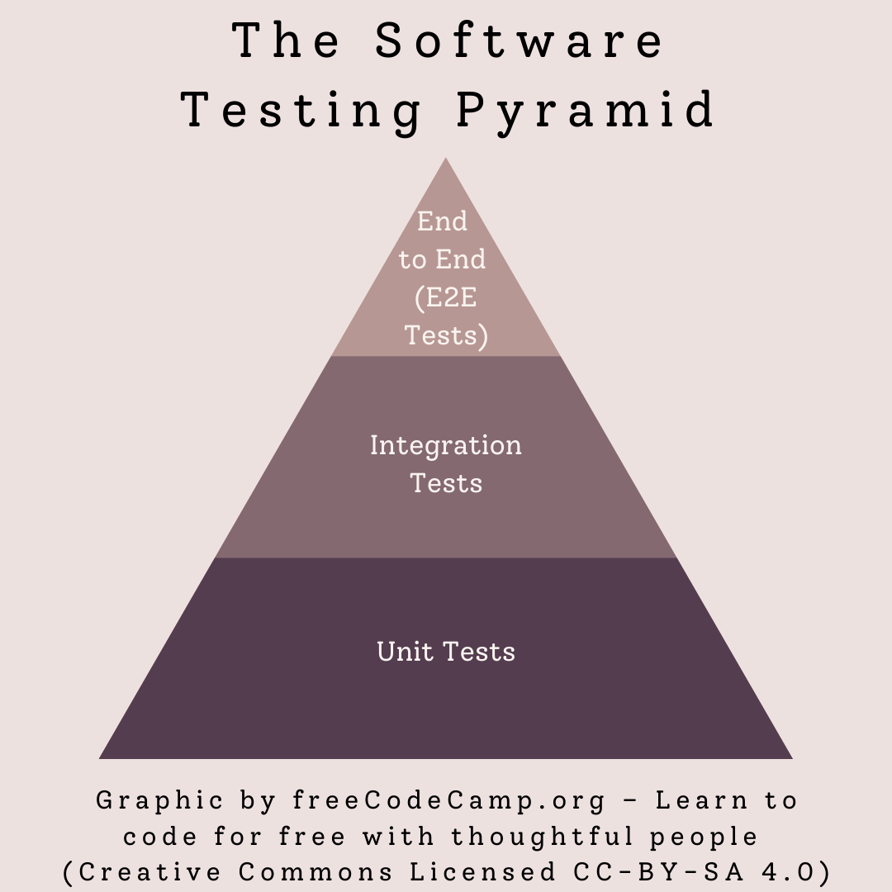

# Three types of testing

Software testing is the principle of actively performing tests on your program in order to ensure that it fulfills its requirements. Testing involves executing whole or parts of the application under test in order to verify functionality. 

By performing these kinds of tests reguarly or when changes occur(regression testing), newly added code are less likely to be errorous and break previously working functionality. In software testing there are three types of tests that are more common. These are:

1. Unit tests
2. Integration tests
3. End to End tests

Each of these tests functionality of the program but vary in the scope or the amount of code they test. Unit tests are the smallest where they are meant to test a single function within the application. Where as End to End tests are the biggest, usually replicating real world usage. 



As they vary in size, the number of them in each project is also correlated. This is nicely represented by a pyramid where the base is built with loads of unit tests, then built further with integration tests and finally at the top a few End to End tests.

This does not mean that because there are fewer End to End tests, they are less valueable. They are just as important as every other tests but each one has their own benefit. The following sections will go into more detail about each test and when they are useful.


## Unit testing

As described in the name `Unit` refers to the smallest piece of code/function that can be isolated in a system. This can be for example a simple function that adds two numbers together. Observe the following code snippet written in typescript:

```typescript
function add(a : number, b : number) : number {
    return a + b;
}
```

It is simple to see that this function does what we expect it to logically. But in order to be absolutely sure, we need to actually run the code. Ensuring that we get the expected outcome is usually done via Assertions that can look like this:

```typescript
it("should proberly add two numbers", () => {
    const result = add(1, 2);
    expect(result).toBe(3);
})
```

Unit tests can look different depending on the programming languague but the principle is the same. Test the smallest isolated part of code.


## Integration testing

The higher up we go in the testing pyramid, the more complex the testing becomes. In integration testing, the goal is to verify the expected functionality when combining different units. Take the `add` function used in the previous example and combine it with a function called `overTen` which returns true when the number is over 10. We can combine these functions to make the following:

```typescript
function addBWhenBIsOverTen(a : number, b : number) : number {
    if overTen(b):
        return a + b;
    return a;
}
```

Now the functionality is more complex and has integrated two seperate units. It is still relatively easy to test such a function but it requires more assertions as the complexity grows. An example of such a test would be:

```typescript
it("should add b when b is over ten", () => {
    const result = add(1, 11);
    expect(result).toBe(12);
})

it("shouldn't add b when b is less than ten", () => {
    const result = add(1, 9);
    expect(result).toBe(1);
}) 
```

You can see how when the complexity grows, the amount of code required to test it also grows. That also makes it natural to have more unit tests as they are easier to make, but also complement them with integration tests to ensure functionality.


## End-to-end testing

The top of the pyramid is usually the tests you see the least of as they require more code/overhead to perform. So what is an End-to-end(E2E) test? The ends refer to the start of when a user navigates the application to the end of it. Most E2E tests simulate how a real user would use the system and can therefore assert if the system doing what is intended for.

This is great for proving that your application actually works. With just unit and integration tests, you can prove that parts of the system work but not its entirety. E2E tests don't do that either but are meant to cover alot more than its building block on the pyramid..

Depending on the scale of the system, you can perform E2E tests on the frontend, backend or both at the same time. In this tutorial we will go into more depth on when E2E testing is good and how to perform them on a React frontend using Jest and Puppeteer.
